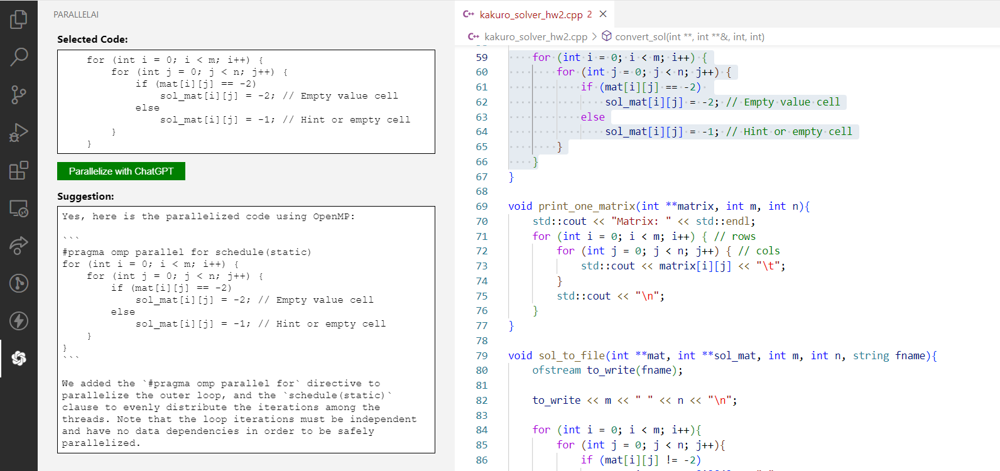

# parallelai README

This extension is a wrapper for asking code parallelization questions to ChatGPT. It uses the OpenAI API to generate answers to questions about parallelization. To use this extension, simply highlight the code you want to parallelize and press to the ParallelAI button from the activity bar.

## Features

The overall usage of the extension is as follows:

1. Highlight the code you want to parallelize.
2. Press the ParallelAI button from the activity bar.
3. Press the Parallelize button from the prompt.

## Requirements

To use this extension you need to have an OpenAI API key. You can get one by signing up from https://platform.openai.com/account/api-keys

## Extension Settings

Include if your extension adds any VS Code settings through the `contributes.configuration` extension point.

For example:

This extension contributes the following settings:

* `parallelai.emptyPrompt`: Set the content of the prompt be when there is no selection.
* `parallelai.selectionPrompt`: Set the content of the prompt be when a code block is selected.

## Known Issues

* The dark theme is not supported yet.

* The fine tuning of the model is not done yet.

* This version is the first release of the extension and it is still under development. If you encounter any issues, please report them at rebahozkoc@gmail.com

## Release Notes

Here is the release notes of the extension:

### 1.0.0

Initial release of ParallelAI
